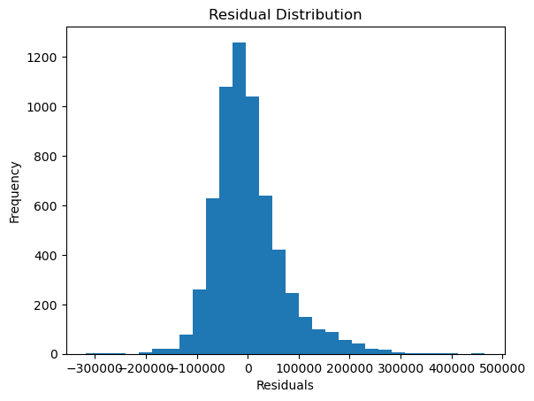

# 📈 Lasso Regression on Housing Dataset


## 🔹 Project Overview
This project implements **Lasso Regression** using scikit-learn to predict house prices from a housing dataset.
Lasso Regression applies **L1 regularization**, which not only helps reduce overfitting but can also perform
feature selection by shrinking some coefficients to zero.

The notebook demonstrates the complete machine learning workflow, including data loading, preprocessing,
model training, evaluation, and residual analysis.

---

## 📂 Repository Contents
Lasso_Regression  
│  
├── Lasso_Regression.ipynb  
├── housing.csv  
├── residual_distribution.png  
└── README.md  

---

## 📊 Dataset
- **File:** housing.csv  
- **Type:** Tabular housing data  
- **Purpose:** Used to train and evaluate a Lasso Regression model for house price prediction  

---

## 🛠️ Libraries & Tools Used
- Python  
- NumPy  
- Pandas  
- Matplotlib  
- scikit-learn  

---

## ⚙️ Project Workflow
1. Load the housing dataset  
2. Perform train-test split  
3. Train a Lasso Regression model  
4. Predict house prices on test data  
5. Evaluate model performance using R² Score  
6. Analyze residual distribution  

---

## 📈 Model Evaluation

**R² Score:** 0.6395660373503593  

**Interpretation:**  
The model explains approximately **64% of the variance** in housing prices.
Lasso regularization helps simplify the model by reducing the impact of less
important features while maintaining competitive performance.

---

## 📉 Residual Analysis

**Residual Distribution (y_test − ridge_pred):**



### Key Insights
- Residuals are approximately normally distributed  
- Indicates that regression assumptions are largely satisfied  
- Feature sparsity introduced by Lasso improves interpretability  

---

## 📌 Key Observations
- Lasso Regression performs implicit feature selection  
- Helps reduce model complexity  
- Useful when dealing with high-dimensional feature spaces  

---

## ▶️ How to Run the Project
1. Clone the repository  
```
git clone https://github.com/your-username/Lasso_Regression.git  
```
2. Install required libraries  
```
pip install numpy pandas matplotlib scikit-learn
```
3. Open `Lasso_Regression.ipynb`  
4. Run all cells sequentially  

---

## 🚀 Future Enhancements
- Compare Lasso vs Ridge vs ElasticNet  
- Tune the alpha parameter using cross-validation  
- Analyze selected vs eliminated features  

---

## 👤 Author
**Nishant Kumar**  
B.Tech – Artificial Intelligence & Machine Learning  
